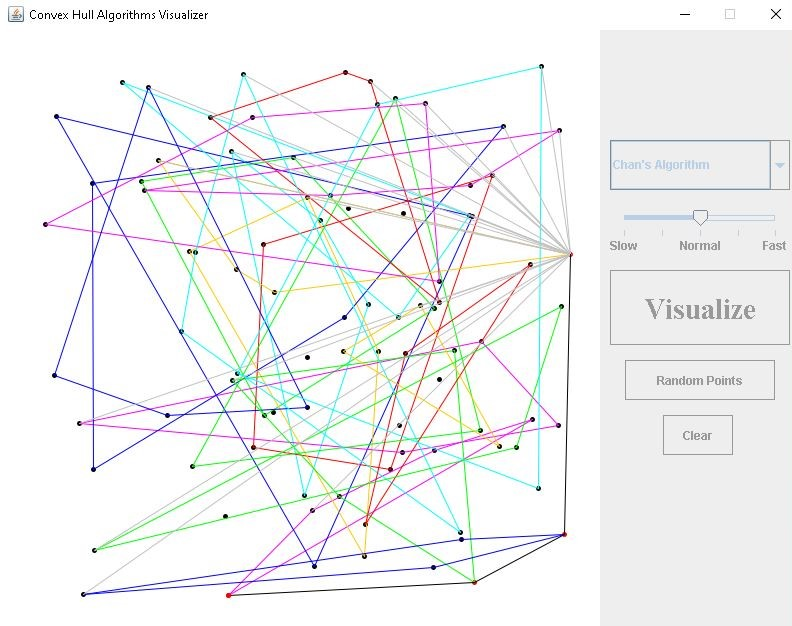
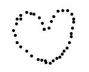
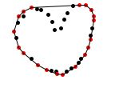

# Convex Hull Algorithms Visualizer
> Created Fall 2020 
> According to [Wikepedia](https://en.wikipedia.org/wiki/Convex_hull), the convex hull may be visualized as the shape enclosed by a rubber band stretched around the subset.
> There are many algorithms that could compute the convex hull given a set of points, which could make it feel overwhelming to learn how each algorithm work. 
> With this visualizer, you could learn the algorithms easily as you would have the first-hand experience of seeing 
> how the algorithm you chose works on the points you chose to form the convex hull.  
> ALERT: The speed of the animation is not proportional to the time complexity of the algorithm

## Table of contents
* [Screenshots](#screenshots)
* [Setup](#setup)
* [Prerequisites](#prerequisites)
* [How to use](#how-to-use)
* [Get to know the Algorithms](#get-to-know-the-algorithms)
* [Favorite Algorithm](#favorite-algorithm)
* [Inspiration](#inspiration)
* [Known Issue(s)](#known-issue)
* [Contact](#contact)
* [Resources Used](#resources-used)

## Screenshots
  

  
Sorry, but no heart is allowed in the world of convex hull

## Setup
If you would like to run the program, simply download the code to your local device. Then, run the .jar file on your device.

## Prerequisites
Make sure you have the latest version of Java SE.  
Click [here](https://www.oracle.com/java/technologies/javase-downloads.html) to download the latest Java SE.

## How to use 
Click on the canvas to generate on that specific spot  
Click on the random points button to generate between 75 and 125 random points   
Click on the clear or reset button to start the process over  
Use the dropdown menu to choose the algorithm you desire   
Use the slider to adjust the speed of the animation  
Finally, click on visualize to see the algorithm you chose work on the points you chose 

## Get to know the Algorithms
**Jarvis March** - O(n^2)   
Jarvis March starts off by finding the leftmost point and use it as a starting point. Then, it continuously loops through the 
list of points to find the next convex points. 
 
**Graham Scan** - O(n lg n)  
Graham Scan starts off by sorting the points by polar order. Then, it checks out the points in polar order and if the point causes 
the convex to concave it, the point gets pop off.
 
**Quick Hull** - O(n lg n)  
Quick Hull starts off by finding the points with the maximum x-coordinate and minimum x-coordinate and connect the two points. 
Then, find the furthest point on its corresponding side from the line formed. Recursively doing so until there are no new maximum-distanced points.
 
**Divide and Conquer** - O(n lg n)  
Divide and Conquer starts off by sorting the points by x-coordinate. Then it recursively divides the points into half until the points are small enough
to be connected. Finally, it recursively merges the convex hull. 
 
**Monotone Chain** - O(n lg n)  
Monotone Chain starts off by sorting the points by X order. Then, it checks if the next point forms a convex point. It does this through 
the whole list to form the lower hull. Repeat the process in backward order to find the upper hull. 
 
**Incremental** - O(n lg n)  
Incremental starts off by sorting the points by X order. Then it forms a small convex from the first two points. It repeatedly merge in the next point
with the already formed convex. 
 
**Marriage Before Conquest** - O(n lg h)  
Marriage Before Conquest starts off by dividing the list of the points into halves by the median x-coordinate. It then recursively create bridges that would 
go through the median x-coordinate. The bridges connect to form the upper hull. The lower hull would be then computed using the same process. 
 
**Chan's Algorithm** - O(n lg h)  
Chan's Algorithm starts off by making a guess <i>m</i> on the number of outputs the convex has. Then it divides the points into <i>(n/m)</i> sections and use 
Graham Scan (or any optimized algorithm) to form sub convex hulls from the sections. Jarvis March is then used to find the rightmost tangent from 
a known point to each section. If the number of output found is greater than <i>m</i>, then start the process over with <i>m^2</i>  
ALERT: For the purpose of the animation, <i>m</i> is doubled instead of squared

## Favorite Algorithm
My favorite algorithm is Chan's algorithm. Chan's algorithm is one of the most elegant algorithm I have seen. 
It amazed me so much how it uses two algorithms that are slower (Graham Scan & Jarvis March) but is still able to be faster. 
Another thing that really amazes me about this algorithm is the idea of starting over. In Chan's algorithm, we start over when 
our guess of the outputs point is less than the output points. For an optimal algorithm, this action seems so counterintuitive 
but only through this way the algorithm could achieve the time complexity of O (n lg h).  

## Inspiration
When I learned about Chan's Algorithm, I was so amazed by it that I shared/explained it to my mom. 
As a non-coder, she couldn't quite grasp why the computer can't just "eyeball" the points and find the points that encapsulates the other points like a human. 
After many failed explanation, I decided to draw out how the algorithm works. 
While drawing out the image to my mom, it came to me that my mom might not be the only one that has a hard time understanding the algorithm without an image.
With that, I decided to build a visualizer that would enable users to see the algorithm they chose work on the points they chose, enabling them to 
have first-hand experience while learning about convex-hull algorithms. 

## Known Issue(s)
Currently, these are the issues I have found and is actively trying to find a solution to it.  
Any advice on how to fix it would be much appreciated. 
 - Occasionally, the Marriage Before Conquest algorithm would leave out a point or include an extra point during the process of constructing the bridge 
 - Implemented double buffering but the page will still flikcer once in a while
 
## Contact
Created by [Kenzie Tee](https://www.linkedin.com/in/kenzie-tee-1276701b2/) - feel free to contact me!

## Resources Used 
[https://en.wikipedia.org/wiki/Convex_hull_algorithms](https://en.wikipedia.org/wiki/Convex_hull_algorithms)  
[http://jeffe.cs.illinois.edu/teaching/373/notes/x05-convexhull.pdf](http://jeffe.cs.illinois.edu/teaching/373/notes/x05-convexhull.pdf)  
[https://algorithmtutor.com/Computational-Geometry/An-efficient-way-of-merging-two-convex-hull/](https://algorithmtutor.com/Computational-Geometry/An-efficient-way-of-merging-two-convex-hull/)  
[http://personal.kent.edu/~rmuhamma/Compgeometry/MyCG/ConvexHull/incrementCH.htm](http://personal.kent.edu/~rmuhamma/Compgeometry/MyCG/ConvexHull/incrementCH.htm)  
[https://sites.cs.ucsb.edu/~suri/cs235/ConvexHull.pdf](https://sites.cs.ucsb.edu/~suri/cs235/ConvexHull.pdf)  
[https://www.cise.ufl.edu/~ungor/courses/fall06/papers/QuickHull.pdf](https://www.cise.ufl.edu/~ungor/courses/fall06/papers/QuickHull.pdf)  
[https://www.ics.uci.edu/~goodrich/teach/geom/notes/ChanConvexHull-notes.pdf](https://www.ics.uci.edu/~goodrich/teach/geom/notes/ChanConvexHull-notes.pdf)  
[https://iq.opengenus.org/chans-algorithm-convex-hull/](https://iq.opengenus.org/chans-algorithm-convex-hull/)  
[https://www.cs.princeton.edu/~chazelle/temp/451/451-2019/KirkSeidel.pdf](https://www.cs.princeton.edu/~chazelle/temp/451/451-2019/KirkSeidel.pdf)  

